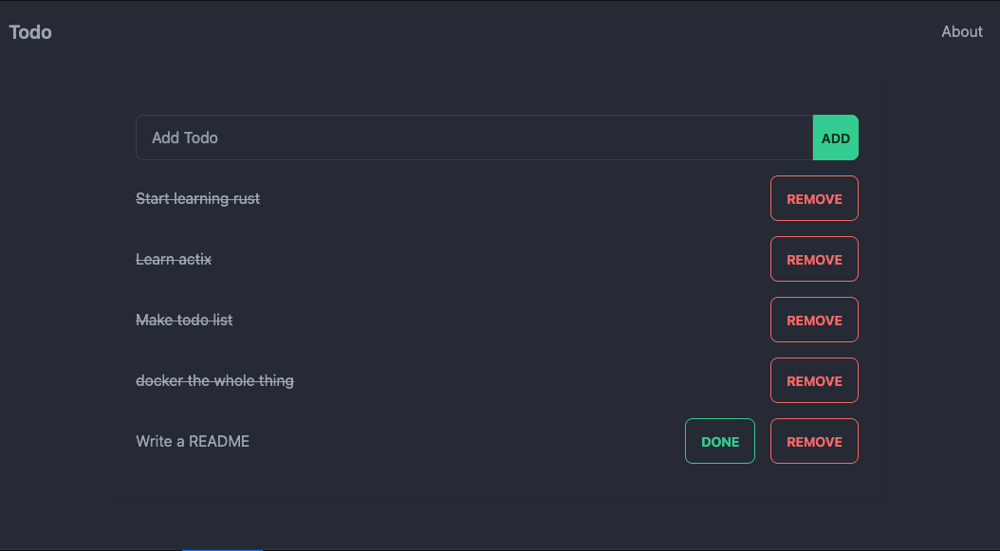

<!-- Improved compatibility of back to top link: See: https://github.com/fatfingers23/vue_actix_template/pull/73 -->
<a name="readme-top"></a>
<!--
*** Thanks for checking out the Best-README-Template. If you have a suggestion
*** that would make this better, please fork the repo and create a pull request
*** or simply open an issue with the tag "enhancement".
*** Don't forget to give the project a star!
*** Thanks again! Now go create something AMAZING! :D
-->


<!-- PROJECT SHIELDS -->
<!--
*** I'm using markdown "reference style" links for readability.
*** Reference links are enclosed in brackets [ ] instead of parentheses ( ).
*** See the bottom of this document for the declaration of the reference variables
*** for contributors-url, forks-url, etc. This is an optional, concise syntax you may use.
*** https://www.markdownguide.org/basic-syntax/#reference-style-links
-->
[![Contributors][contributors-shield]][contributors-url]
[![Forks][forks-shield]][forks-url]
[![Stargazers][stars-shield]][stars-url]
[![Issues][issues-shield]][issues-url]
[![MIT License][license-shield]][license-url]


<!-- PROJECT LOGO -->
<br />
<div align="center">

[//]: # (  <a href="https://github.com/fatfingers23/vue_actix_template">)

[//]: # (    )

[//]: # (  </a>)

<h3 align="center">Vue Actix Template</h3>

  <p align="center">
    Simple template for a Vue frontend and actix backend
    <br />
    <br />
</div>


<!-- TABLE OF CONTENTS -->
<details>
  <summary>Table of Contents</summary>
  <ol>
    <li>
      <a href="#about-the-project">About The Project</a>
      <ul>
        <li><a href="#built-with">Built With</a></li>
      </ul>
    </li>
    <li>
      <a href="#getting-started">Getting Started</a>
      <ul>
        <li><a href="#docker-setup">Docker setup</a></li>
      </ul>
    </li>
    <li><a href="#license">Points of Interest</a></li>
    <li><a href="#license">License</a></li>
  </ol>
</details>


<!-- ABOUT THE PROJECT -->

## About The Project



This repo is a simple project using Vue as the front end and actix as the backend. Meant to be a template or hold
examples for
your actix projects with a JS frontend. Also JS is used here you can also use this with a rust SPA framework Heavy
inspiration
from [cookiecutter-rust-actix-clean-architecture](https://github.com/microsoft/cookiecutter-rust-actix-clean-architecture).
This is a "batteries included" template for a lot of things, but falls short in a few places. Especially in the area of
Docker hosting with a SSL. So some things may not work as excepted. Feel free to reach out or submit and PRS
to improve this template.

Features:

* Example on how actix can host a SPA and resolve to the front end router of the selected framework.
* Uses [diesel-async](https://crates.io/crates/diesel-async) for postgres async queries in diesel.
* A somewhat OOP approach to actix, with trying to not have too much boilerplate.
* Docker compose for self hosting.
    * Includes ngix for reverse proxying and hosting ssl.
    * Includes postgres for database.
    * Includes actix for backend.
    * Includes certbot for renewing and creating a ssl.

<p align="right">(<a href="#readme-top">back to top</a>)</p>

### Built With

* [actix](https://actix.rs/)
* [diesel](https://diesel.rs/)
* [diesel-async](https://crates.io/crates/diesel-async)
* [Vue](https://vuejs.org/)
* [tailwindcss](https://tailwindcss.com/)

<p align="right">(<a href="#readme-top">back to top</a>)</p>


<!-- GETTING STARTED -->

## Getting Started

_This is instructions on getting the actix application running, more details on the front end can be
found [here](vue-project/README.md)_

### Running the application

1. Make a copy of [.env.save](.env.save) and name it `.env`, and set your variables.
    * Note `SESSION_KEY` needs to be a 64 bit key.
2. If you are using docker for the database can run `docker-compose up -d db` to start just the database for
   development.
3. Will need to run the diesel migrations to setup the database.

```sh
diesel migration run
```

4. If you are not using the included frontend can skip this part.
    1. Install the front end dependencies
       ```sh
       cd vue-project
       npm install
       ```
    2. To run the front end
       ```sh
       npm run build:dev
       ```
5. To run the application

  ```sh
  cargo run
  ```

6. Can check to make sure it's running at [http://localhost:8080/api/hello](http://localhost:8080/api/hello)

### Docker setup

_Below is some lose documentation on setting up the project with docker_

### With SSL

1. If you are wanting to use SSL will need to make sure of the following
    * `DOMAIN` is set in the `.env` file to the domain you are using.
    * `EMAIL` is set in the `.env` file to a real email you use.
    * `SSL` is set to True in the `.env` file to make sure secure cookies are used
    * Will need the domain pointing to the server running the containers as well as port `80` and `443` open. This is
      the URL lets encrypt will use to verify the domain.
2. Set the contents of [default.conf.template](./nginx/default.conf.template) to the following. This is to get your initial cert.

    ``` nginx configuration
        server {
          listen 80 default_server;
          server_name _;
          
          location ~ /.well-known/acme-challenge/ {
                root /var/www/certbot;
           }
        }
    ```
3. Run `docker-compose up` to start the containers and cert bot will attempt to get a cert for your domain.
4. The certbot container should have gotten the cert. Now need to set the contents of [default.conf.template](./nginx/default.conf.template) to the following.
   ``` nginx configuration
   # always redirect to https
    server {
        listen 80 default_server;
        server_name _;
        return 301 https://$host$request_uri;
    }

    server {
        listen 443 ssl http2;
        ssl_certificate     /etc/letsencrypt/live/${DOMAIN}/fullchain.pem;
        ssl_certificate_key /etc/letsencrypt/live/${DOMAIN}/privkey.pem;
        server_name ${DOMAIN};
        root /var/www/html;
        index index.php index.html index.htm;

        location / {
            proxy_pass http://actix-web:8080/;
        }

        location ~ /.well-known/acme-challenge/ {
            root /var/www/certbot;
        }
    }

    ``` 
5. Run `docker-compose up` again to restart the containers with the new config and should have it running fully with the SSL!

### Without SSL
1. Set the contents of [default.conf.template](./nginx/default.conf.template) to the following.
   ``` nginx configuration
    server {
        listen 80 default_server;

        server_name _;
        location / {
            proxy_pass http://actix-web:8080/;
        }
    }
   ```
2. I would also comment out the `certbot` service in the [docker-compose.yml](./docker-compose.yml) file.
3. Run `docker-compose up` to start the containers.
4. Should be running at [http://localhost](http://localhost)
5. Profit!
<p align="right">(<a href="#readme-top">back to top</a>)</p>


## Points of Interest
 * In [main.rs:61](./src/main.rs) can see how the SPA is hosted. Also on line 62 is how I handle allowing the front end router to take over. Anything that would be 404 is sent to the `index.html`
 * [get_user_id.rs](./src/middleware/get_user_id.rs) is an example of using actix session store in a middleware to set a user id to save todos.
 * [postgres.rs](./src/data_access/databases/postgresql.rs) is an example of using diesel async to set up a connection pool. It is then consumed in [todo.rs](./src/data_access/repositories/todo.rs) 

<!-- LICENSE -->
## License

Distributed under the MIT License. See `LICENSE.txt` for more information.

<p align="right">(<a href="#readme-top">back to top</a>)</p>


<!-- MARKDOWN LINKS & IMAGES -->
<!-- https://www.markdownguide.org/basic-syntax/#reference-style-links -->
[contributors-shield]: https://img.shields.io/github/contributors/fatfingers23/vue_actix_template.svg?style=for-the-badge
[contributors-url]: https://github.com/fatfingers23/vue_actix_template/graphs/contributors
[forks-shield]: https://img.shields.io/github/forks/fatfingers23/vue_actix_template.svg?style=for-the-badge
[forks-url]: https://github.com/fatfingers23/vue_actix_template/network/members
[stars-shield]: https://img.shields.io/github/stars/fatfingers23/vue_actix_template.svg?style=for-the-badge
[stars-url]: https://github.com/fatfingers23/vue_actix_template/stargazers
[issues-shield]: https://img.shields.io/github/issues/fatfingers23/vue_actix_template.svg?style=for-the-badge
[issues-url]: https://github.com/fatfingers23/vue_actix_template/issues
[license-shield]: https://img.shields.io/github/license/fatfingers23/vue_actix_template.svg?style=for-the-badge
[license-url]: https://github.com/fatfingers23/vue_actix_template/blob/master/LICENSE.txt
[linkedin-shield]: https://img.shields.io/badge/-LinkedIn-black.svg?style=for-the-badge&logo=linkedin&colorB=555
[linkedin-url]: https://linkedin.com/in/othneildrew
[product-screenshot]: images/screenshot.png
[Next.js]: https://img.shields.io/badge/next.js-000000?style=for-the-badge&logo=nextdotjs&logoColor=white
[Next-url]: https://nextjs.org/
[React.js]: https://img.shields.io/badge/React-20232A?style=for-the-badge&logo=react&logoColor=61DAFB
[React-url]: https://reactjs.org/
[Vue.js]: https://img.shields.io/badge/Vue.js-35495E?style=for-the-badge&logo=vuedotjs&logoColor=4FC08D
[Vue-url]: https://vuejs.org/
[Angular.io]: https://img.shields.io/badge/Angular-DD0031?style=for-the-badge&logo=angular&logoColor=white
[Angular-url]: https://angular.io/
[Svelte.dev]: https://img.shields.io/badge/Svelte-4A4A55?style=for-the-badge&logo=svelte&logoColor=FF3E00
[Svelte-url]: https://svelte.dev/
[Laravel.com]: https://img.shields.io/badge/Laravel-FF2D20?style=for-the-badge&logo=laravel&logoColor=white
[Laravel-url]: https://laravel.com
[Bootstrap.com]: https://img.shields.io/badge/Bootstrap-563D7C?style=for-the-badge&logo=bootstrap&logoColor=white
[Bootstrap-url]: https://getbootstrap.com
[JQuery.com]: https://img.shields.io/badge/jQuery-0769AD?style=for-the-badge&logo=jquery&logoColor=white
[JQuery-url]: https://jquery.com 
